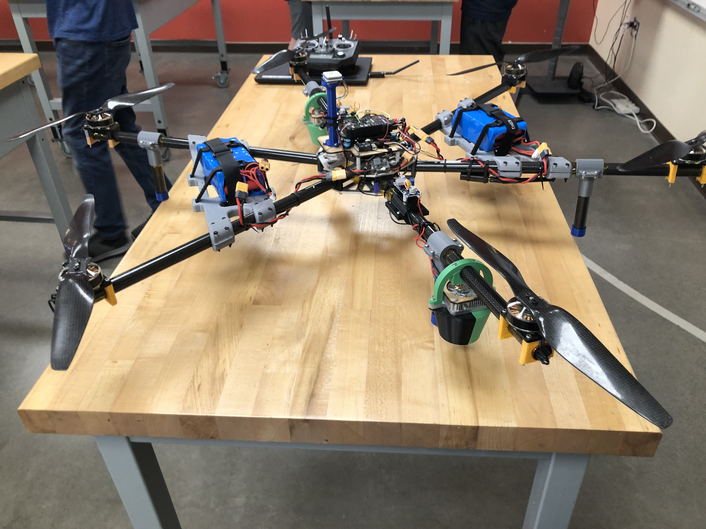

# CPE 322 - Design 6

> Jack Gonser - CPE Student

**Stevens Institute of Technology**

*Labs/Assignments*
1. [A0 *Repo*](https://github.com/PhysicsAreBad/d6)
2. [A1 *Group Website*](https://sites.google.com/stevens.edu/cpe-322-group-2/home/)
3. [Lab 1](/)
4. [Lab 2](/l2)
5. [Lab 3](/l3)
6. [Lab 5](/l5)
7. [Lab 6](/l6)
8. [Lab 9](/l9)

*Some previous/current side projects*
- `Automated lighting drone (see photo)`
- `Image classifiers`
- `E2E encryption service (in progress)`

---

